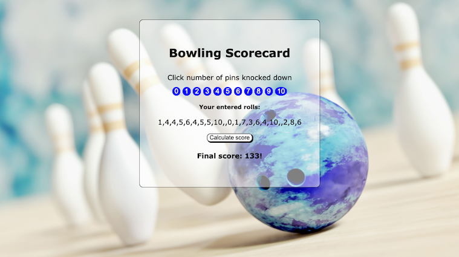
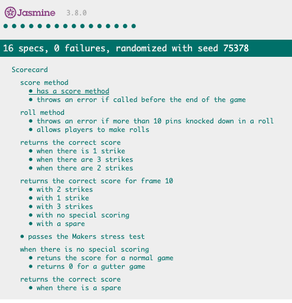

# Bowling Scorecard Calculator

This is my solution to the week 6 Makers weekend challenge which is to build a bowling scorecard app in JS. 

This project builds on my learning for the week including writing Javascript code, interacting with the DOM and doing some simple CSS styling. The program was built entirely through TDD with Jasmine as the test framework.

The business logic was originally designed in Ruby as part of the previous weekend challenge and can be found [here](https://github.com/ArifEbrahim/bowling-challenge-ruby)

Screenshot of app:

## How to use

#### To set up the project

Clone this repo to your computer and then open "index.html" in your web browser.

#### Testing

Testing was completed in Jasmine and all tests are passing. To view the tests, open the file "SpecRunner.html" in your web browser. A screenshot is included below.

## Improvemensts

Time permitting I would address the following:
- more testing of edge cases 
- adding further error checks e.g. user cannot score more than 10 pins per frame
- improved UI
  - better display for the rolls array
  