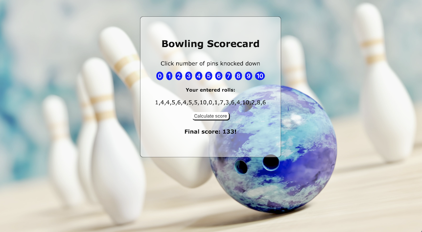
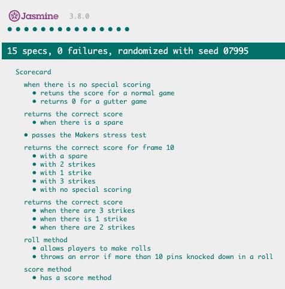

# Bowling Scorecard Calculator

This is my solution to the week 6 Makers weekend challenge which is to build a bowling scorecard app in JS. 

This project builds on my learnings from the week including writing Javascript code, interacting with the DOM and doing some simple CSS styling. The program was built entirely through TDD with Jasmine as the test framework.

The business logic was originally designed in Ruby as part of the previous weekend challenge and can be found [here](https://github.com/ArifEbrahim/bowling-challenge-ruby)

The app is live and hosted [here](https://arifebrahim.github.io/bowling_challenge_JS/)

## Screenshot

## Solution design

A lot of time was spent on the front end going through the program requirements in detail and mapping out the potential scoring permutations.

The scoring rules follow the traditional rules that can be found [here](https://en.wikipedia.org/wiki/Ten-pin_bowling#Traditional_scoring)

Some edge cases were implemented such as :
- The score can only be calculated once to stop users from continuing to add to their final score
- The roll buttons will not add to the score after the game is finished
- Users cannot knock down more than 10 pins per roll

## How to use

#### To set up the project

Clone this repo to your computer and then open "index.html" in your web browser.

#### To calculate bowling score

Click on the button corresponding to the pins knocked down per roll in each frame. At the end of the game (considered to be 10 frames) click the "Calculate score button" to see your final score. The scorecard will throw an error if you try to calculate the score before 10 frames are completed.

The Scorecard knows when there is a strike or spare. When there is a strike, click the "10" button and then move on to the next frame. The program will automatically assign a score of 0 to roll 2 of that frame.

#### Testing

Testing was completed in Jasmine and all tests are passing. To view the tests, open the file "SpecRunner.html" in your web browser. A screenshot is included below.

## Improvemensts

Time permitting I would address the following:
- more testing of edge cases e.g.
  - users cannot knock down more than 10 pins per frame
  - additional logic to determine max rolls vs hard coded number
- make the interface more DRY

Original exercise [here](https://github.com/makersacademy/bowling-challenge)